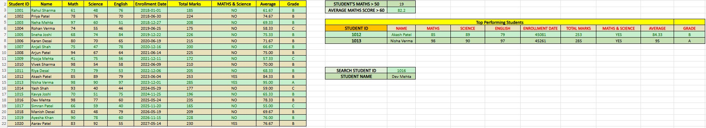
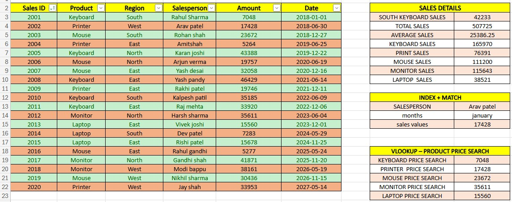
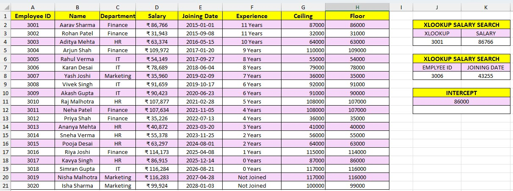

<div align="center">

<a href="https://github.com/patilkalpesh0312/FUNDAMENTAL-BOOSTER_EXCEL">

</a>

# 📊 FUNDAMENTAL BOOSTER

### Excel Data Analysis & Formula Practice Project

**Turning raw Excel data into useful insights — one formula at a time.**

[](#)
[](#)
[](#)

---

## 🚀 About the Project

**Fundamental Booster** is an Excel practice project focused on practical data analysis, spreadsheet formulas and dynamic lookup techniques.

The workbook contains three main datasets:

🎓 **Student Data** — marks, averages, grades, enrollment dates and top-performing students

💰 **Sales Data** — products, regions, salespeople, amounts and dates

👨‍💼 **Employee Data** — departments, salaries and joining dates

---

## 🗂️ Workbook Structure

| Sheet | Data | Analysis / Formula Work |
|:---:|:---:|:---:|
| 🎓 **STUDENT DATA** | Student ID, Name, Math, Science, English, Enrollment Date | Total Marks, Average, Grade, Maths & Science, COUNTIFS, FILTER |
| 💰 **SALES DATA** | Sales ID, Product, Region, Salesperson, Amount, Date | SUMIFS, INDEX + MATCH, VLOOKUP |
| 👨‍💼 **EMPLOYEE DATA** | Employee ID, Name, Department, Salary, Joining Date | XLOOKUP Salary, XLOOKUP Joining Date |

---

# 🎓 Student Data

The Student Data sheet contains student marks, enrollment dates and calculated performance indicators.

### 📸 Sheet Preview



### 🔎 Analysis Included

| Feature | Purpose |
|:---:|:---:|
| `IF` | Grade classification |
| `AND` | Maths & Science condition |
| `COUNTIFS` | Conditional student count |
| `AVERAGE` / `AVERAGEIFS` | Performance analysis |
| `FILTER` | Extract top-performing students |
| Student ID Search | Find student information dynamically |

---

# 💰 Sales Data

The Sales Data sheet contains product, region, salesperson, amount and date information.

### 📸 Sheet Preview



### 📊 Sales Analysis

The workbook includes:

- **SUMIFS** for South Keyboard Sales
- Sales totals and averages
- Product-wise sales calculations
- **INDEX + MATCH** for salesperson + month sales value
- **VLOOKUP** product price search

### 🔥 VLOOKUP Example

```excel
=VLOOKUP("Mouse",B2:E21,4,FALSE)
```

This searches for the selected product and returns the corresponding value from the fourth column of the selected table range.

---

# 👨‍💼 Employee Data

The Employee Data sheet contains employee IDs, names, departments, salaries and joining dates.

### 📸 Sheet Preview

<div align="center">



</div>

### ⚡ XLOOKUP Examples

**Salary Lookup**

```excel
=XLOOKUP(G3,A2:A21,D2:D21)
```

**Joining Date Lookup**

```excel
=XLOOKUP(G6,A2:A21,E2:E21)
```

These formulas use the Employee ID to dynamically return the matching employee information.

---

# 🧠 Excel Functions Used

| Function | Used For |
|:---:|:---:|
| `IF` | Grade classification |
| `AND` | Multiple-condition checking |
| `COUNTIFS` | Conditional counting |
| `AVERAGE` | Average calculation |
| `AVERAGEIFS` | Conditional average |
| `SUM` | Total calculation |
| `SUMIF / SUMIFS` | Sales analysis |
| `VLOOKUP` | Product lookup |
| `XLOOKUP` | Employee lookup |
| `INDEX + MATCH` | Dynamic sales search |
| `FILTER` | Extract matching student records |
| `TEXT` | Month/date-based matching |

---

# 📈 Project Highlights

### 🎓 Student Analysis

- Total marks and average calculation
- Grade classification
- Maths & Science condition
- Conditional counting
- Top-performing student extraction

### 💰 Sales Analysis

- Product and region analysis
- Conditional sales totals
- Salesperson + month lookup
- Product price search

### 👨‍💼 Employee Analysis

- Dynamic salary lookup
- Dynamic joining-date lookup
- Structured employee records

---

# 🎯 Learning Goals

- Build strong Excel fundamentals
- Practice real-world style datasets
- Understand lookup functions
- Improve formula-writing skills
- Perform structured data analysis
- Create clean and organized Excel worksheets

---

## 📸 Complete Workbook Screenshots

### 🎓 Student Data


### 💰 Sales Data


### 👨‍💼 Employee Data

<div align="center">


</div>

---

<a href="https://github.com/patilkalpesh0312/FUNDAMENTAL-BOOSTER_EXCEL">

</a>

### ⭐ FUNDAMENTAL BOOSTER

**Excel Practice • Data Analysis • Formula Skills**

**Keep Learning • Keep Practicing • Keep Growing 🚀**

</div>
